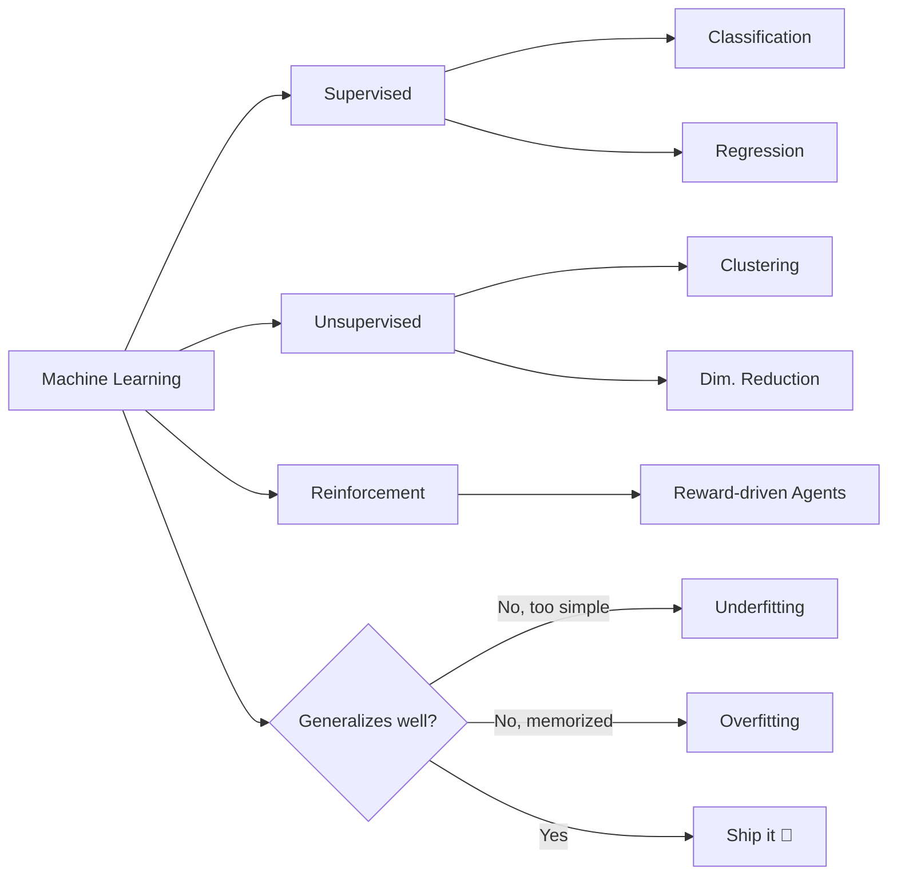

# Chapter 01 — The Machine Learning Landscape

> What ML actually is, and the map of the territory before you touch any code.

**📅 Suggested pace:** Day 1 of the 30-day plan · [⬅ Back to main plan](../../README.md)

---

## 🧠 What this chapter is about

This opening chapter is a map, not a toolbox. It sorts machine learning into a small set of orthogonal categories (how it learns, how it generalizes, whether it learns online or in batch) so that every algorithm you meet later has a clear home. The single idea to hold onto: a model is only useful if it generalizes to data it hasn't seen, and every technique in the rest of the book is really just a different strategy for fighting overfitting.

## 📌 Key concepts

- Supervised vs. unsupervised vs. reinforcement learning
- Batch vs. online learning
- Instance-based vs. model-based learning
- Why generalization is the whole game: overfitting & underfitting
- The 8 steps of a real ML project

## 🗺️ Visual overview

## 💡 Key takeaway

> Every ML method you'll learn is a different answer to one question: how do we generalize instead of memorize?

## 🛠️ Practice in `01_the_machine_learning_landscape.ipynb`

This folder's notebook is a **starter**, not a solution key. Work through the book's examples first, then use
these prompts to go one step further on your own:

1. Classify 5 real products/apps you use daily into supervised/unsupervised/RL
2. Write one paragraph: what would overfitting look like for a spam filter?
3. Sketch the 8-step ML project checklist from memory

## ✅ Progress

- [x] Read the chapter
- [x] Ran and understood the book's code examples
- [x] Completed the practice exercises above in `01_the_machine_learning_landscape.ipynb`
- [x] Could explain this chapter's key takeaway to someone else in 2 minutes

---

⬅ [Chapter 01](../01-the-machine-learning-landscape/README.md) · [Main README](../../README.md) · ➡ [Chapter 02](../02-end-to-end-machine-learning-project/README.md)
