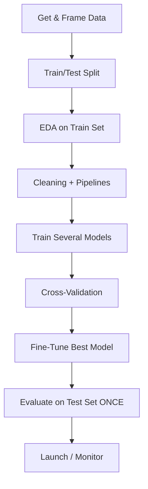

# Chapter 02 — End-to-End Machine Learning Project

> The full pipeline, once, so you have a template for every project after this.

**📅 Suggested pace:** Days 2-3 of the 30-day plan · [⬅ Back to main plan](../../README.md)

---

## 🧠 What this chapter is about

This is the chapter that turns theory into muscle memory. Using the California housing dataset, it walks the complete lifecycle: get the data, split it correctly, explore it, clean it with reusable Pipelines, train several models, cross-validate, tune hyperparameters, and evaluate on the test set exactly once. Every future chapter assumes you're comfortable with this loop — it's the template you'll reuse for the rest of your ML career.

## 📌 Key concepts

- Framing the problem & picking a performance measure
- Train/test split & avoiding data snooping bias
- Exploratory data analysis (EDA) and visualizing correlations
- Data cleaning, imputation, and Scikit-Learn Pipelines
- Feature scaling & encoding categorical attributes
- Model selection, cross-validation, and fine-tuning (GridSearchCV)

## 🗺️ Visual overview

## 💡 Key takeaway

> A messy notebook can still be a rigorous project if the train/test split happens before you look at anything.

## 🛠️ Practice in `02_end_to_end_machine_learning_project.ipynb`

This folder's notebook is a **starter**, not a solution key. Work through the book's examples first, then use
these prompts to go one step further on your own:

1. Rebuild the housing pipeline using a different dataset (e.g. Kaggle's Ames Housing)
2. Swap the RandomForestRegressor for GradientBoosting and compare CV scores
3. Break your own rule once: peek at the test set early and see how tempting it is to overfit to it

## ✅ Progress

- [x] Read the chapter
- [x] Ran and understood the book's code examples
- [x] Completed the practice exercises above in `02_end_to_end_machine_learning_project.ipynb`
- [x] Could explain this chapter's key takeaway to someone else in 2 minutes

---

⬅ [Chapter 01](../01-the-machine-learning-landscape/README.md) · [Main README](../../README.md) · ➡ [Chapter 03](../03-classification/README.md)
