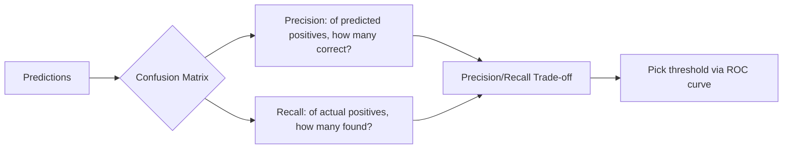

# Chapter 03 — Classification

> Predicting categories — and learning why accuracy is often a lie.

**📅 Suggested pace:** Day 4 of the 30-day plan · [⬅ Back to main plan](../../README.md)

---

## 🧠 What this chapter is about

Using MNIST digits, this chapter builds a binary classifier and immediately shows why a 90%+ 'accuracy' can still mean a useless model. Precision and recall replace accuracy as the real scorecard, and the ROC curve becomes the tool for comparing classifiers independent of a chosen threshold. The chapter closes with error analysis: actually looking at what the model gets wrong, which matters more than any single metric.

## 📌 Key concepts

- Binary vs. multiclass vs. multilabel vs. multioutput classification
- Confusion matrix, precision, recall, and the precision/recall trade-off
- ROC curve and ROC AUC
- Why accuracy fails on imbalanced datasets (MNIST '5-detector' example)
- Error analysis by inspecting misclassified examples

## 🗺️ Visual overview

## 💡 Key takeaway

> On imbalanced data, a lazy classifier that always predicts 'no' can still look 90% accurate — never trust accuracy alone.

## 🛠️ Practice in `03_classification.ipynb`

This folder's notebook is a **starter**, not a solution key. Work through the book's examples first, then use
these prompts to go one step further on your own:

1. Train a classifier where you intentionally lower the decision threshold and watch precision drop
2. Plot precision vs. recall vs. threshold for your own binary classifier
3. Find the 10 most confidently-wrong predictions and explain what confused the model

## ✅ Progress

- [x] Read the chapter
- [ ] Ran and understood the book's code examples
- [ ] Completed the practice exercises above in `03_classification.ipynb`
- [x] Could explain this chapter's key takeaway to someone else in 2 minutes

---

⬅ [Chapter 02](../02-end-to-end-machine-learning-project/README.md) · [Main README](../../README.md) · ➡ [Chapter 04](../04-training-linear-models/README.md)
