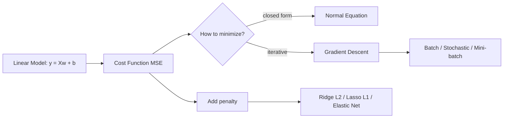

# Chapter 04 — Training Linear Models

> Opening the black box: how models actually learn their parameters.

**📅 Suggested pace:** Day 5 of the 30-day plan · [⬅ Back to main plan](../../README.md)

---

## 🧠 What this chapter is about

This is the chapter where 'training a model' stops being magic. You derive linear regression two ways — a closed-form Normal Equation and iterative Gradient Descent — and see why GD scales better. Regularization (Ridge/Lasso/Elastic Net) is introduced as the direct antidote to the overfitting you saw in Chapter 1, and logistic/softmax regression extend the same linear machinery to classification.

## 📌 Key concepts

- Normal Equation vs. Gradient Descent (batch, stochastic, mini-batch)
- Learning rate and convergence
- Polynomial regression and the bias/variance trade-off
- Regularization: Ridge, Lasso, and Elastic Net
- Logistic Regression & Softmax Regression

## 🗺️ Visual overview

## 💡 Key takeaway

> Regularization isn't a trick, it's the mathematical version of Chapter 1's advice: prefer simpler models that generalize.

## 🛠️ Practice in `04_training_linear_models.ipynb`

This folder's notebook is a **starter**, not a solution key. Work through the book's examples first, then use
these prompts to go one step further on your own:

1. Implement batch gradient descent from scratch with NumPy (no sklearn)
2. Plot the learning curve for 3 different learning rates and find one that diverges
3. Compare Ridge vs. Lasso coefficients on a dataset with useless features — which one zeroes them out?

## ✅ Progress

- [ ] Read the chapter
- [ ] Ran and understood the book's code examples
- [ ] Completed the practice exercises above in `04_training_linear_models.ipynb`
- [ ] Could explain this chapter's key takeaway to someone else in 2 minutes

---

⬅ [Chapter 03](../03-classification/README.md) · [Main README](../../README.md) · ➡ [Chapter 05](../05-decision-trees/README.md)
