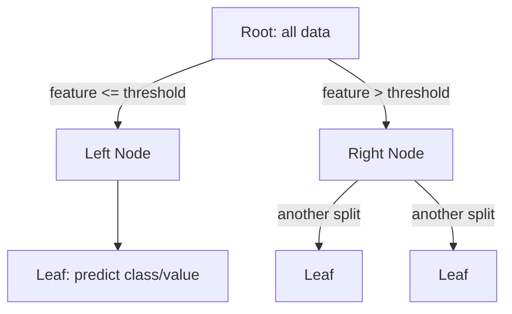

# Chapter 05 — Decision Trees

> A model you can literally read — until you let it grow too deep.

**📅 Suggested pace:** Day 6 of the 30-day plan · [⬅ Back to main plan](../../README.md)

---

## 🧠 What this chapter is about

Decision trees are the most interpretable model in the book — you can print one out and trace exactly why it made a prediction. This chapter covers how CART splits nodes using Gini impurity, why unrestrained trees overfit almost every time, and how a handful of hyperparameters keep them in check. It also previews the trees' one big weakness (instability), which is exactly what Chapter 6's ensembles fix.

## 📌 Key concepts

- CART algorithm & Gini impurity vs. entropy
- How trees make predictions (white-box interpretability)
- Regularization via max_depth, min_samples_leaf, etc.
- Decision trees for regression
- Instability: trees are sensitive to small data changes

## 🗺️ Visual overview

## 💡 Key takeaway

> A decision tree you can explain in one sentence per split is powerful — but that same simplicity makes it unstable.

## 🛠️ Practice in `05_decision_trees.ipynb`

This folder's notebook is a **starter**, not a solution key. Work through the book's examples first, then use
these prompts to go one step further on your own:

1. Train an unrestricted tree, then one with max_depth=3 — compare test accuracy
2. Export and visualize a tree with graphviz/plot_tree and manually trace one prediction
3. Rotate your training data 45° and retrain — watch how much the tree boundary changes

## ✅ Progress

- [ ] Read the chapter
- [ ] Ran and understood the book's code examples
- [ ] Completed the practice exercises above in `05_decision_trees.ipynb`
- [ ] Could explain this chapter's key takeaway to someone else in 2 minutes

---

⬅ [Chapter 04](../04-training-linear-models/README.md) · [Main README](../../README.md) · ➡ [Chapter 06](../06-ensemble-learning-and-random-forests/README.md)
