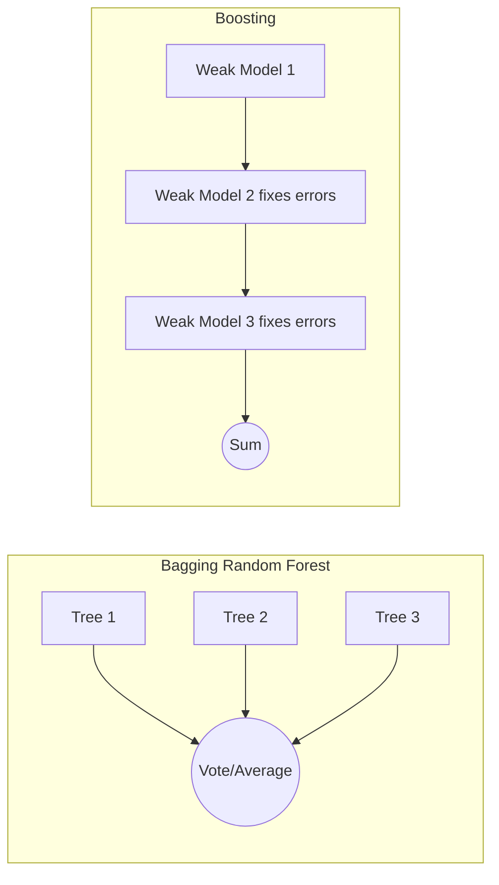

# Chapter 06 — Ensemble Learning and Random Forests

> Why a crowd of mediocre models beats one great one.

**📅 Suggested pace:** Day 7 of the 30-day plan · [⬅ Back to main plan](../../README.md)

---

## 🧠 What this chapter is about

This chapter turns the instability of single decision trees (Chapter 5) into a strength: average many imperfect, uncorrelated trees together and the errors cancel out. You'll compare bagging (parallel, independent trees) with boosting (sequential, each tree fixing the last one's mistakes), and see why Random Forests and Gradient Boosting are two of the most reliable 'default' algorithms in applied ML.

## 📌 Key concepts

- Voting classifiers (hard vs. soft voting)
- Bagging and pasting
- Random Forests & feature importance
- Boosting: AdaBoost and Gradient Boosting
- Stacking

## 🗺️ Visual overview

## 💡 Key takeaway

> Ensembles work because independent errors cancel out — the trick is keeping your models diverse.

## 🛠️ Practice in `06_ensemble_learning_and_random_forests.ipynb`

This folder's notebook is a **starter**, not a solution key. Work through the book's examples first, then use
these prompts to go one step further on your own:

1. Compare a single Decision Tree vs. RandomForestClassifier on the same dataset/seed
2. Plot feature_importances_ from a Random Forest and sanity-check it against intuition
3. Train AdaBoost and GradientBoosting on the same data — compare training time & accuracy

## ✅ Progress

- [ ] Read the chapter
- [ ] Ran and understood the book's code examples
- [ ] Completed the practice exercises above in `06_ensemble_learning_and_random_forests.ipynb`
- [ ] Could explain this chapter's key takeaway to someone else in 2 minutes

---

⬅ [Chapter 05](../05-decision-trees/README.md) · [Main README](../../README.md) · ➡ [Chapter 07](../07-dimensionality-reduction/README.md)
