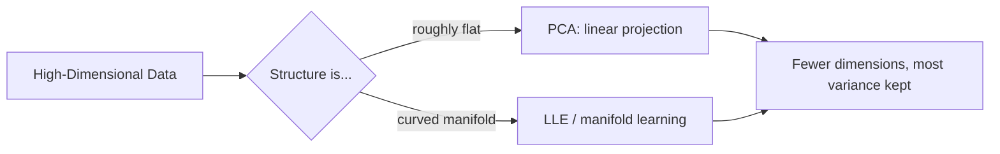

# Chapter 07 — Dimensionality Reduction

> Fighting the curse of dimensionality by throwing away the boring directions.

**📅 Suggested pace:** Day 8 of the 30-day plan · [⬅ Back to main plan](../../README.md)

---

## 🧠 What this chapter is about

In high dimensions, data gets sparse and distances stop being meaningful — the 'curse of dimensionality.' PCA is the workhorse fix: it finds the axes of maximum variance and projects data onto a handful of them, keeping most of the signal while dropping most of the noise. The chapter also covers when projection isn't enough and manifold techniques (like LLE) are needed instead.

## 📌 Key concepts

- The curse of dimensionality
- Projection vs. Manifold learning
- PCA (variance-preserving projection) and explained variance ratio
- Kernel PCA
- LLE and other manifold techniques

## 🗺️ Visual overview

## 💡 Key takeaway

> Dimensionality reduction isn't about compression for its own sake — it's about keeping the signal and dropping the noise.

## 🛠️ Practice in `07_dimensionality_reduction.ipynb`

This folder's notebook is a **starter**, not a solution key. Work through the book's examples first, then use
these prompts to go one step further on your own:

1. Reduce MNIST to 2D with PCA and plot it colored by digit label
2. Find how many components are needed to preserve 95% of variance in a dataset of your choice
3. Compress then reconstruct images with PCA and visually inspect the information lost

## ✅ Progress

- [ ] Read the chapter
- [ ] Ran and understood the book's code examples
- [ ] Completed the practice exercises above in `07_dimensionality_reduction.ipynb`
- [ ] Could explain this chapter's key takeaway to someone else in 2 minutes

---

⬅ [Chapter 06](../06-ensemble-learning-and-random-forests/README.md) · [Main README](../../README.md) · ➡ [Chapter 08](../08-unsupervised-learning/README.md)
