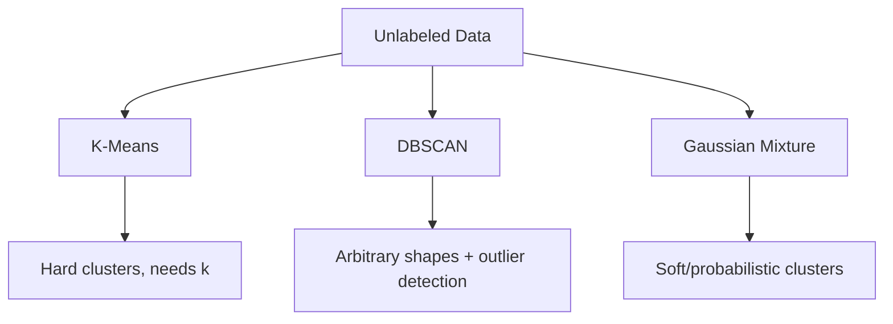

# Chapter 08 — Unsupervised Learning Techniques

> Finding structure in data that has no labels at all.

**📅 Suggested pace:** Day 9 of the 30-day plan · [⬅ Back to main plan](../../README.md)

---

## 🧠 What this chapter is about

Most real-world data isn't labeled, and this chapter is about extracting value from it anyway. K-Means partitions data into k groups by distance; DBSCAN finds clusters of arbitrary shape based on density and naturally flags outliers; Gaussian Mixture Models add a probabilistic, soft-clustering view. The chapter ends by showing clustering isn't just descriptive — it can generate features or pseudo-labels for downstream supervised models.

## 📌 Key concepts

- K-Means clustering & the elbow/silhouette method
- DBSCAN and density-based clustering
- Gaussian Mixture Models
- Anomaly & novelty detection
- Clustering for preprocessing and semi-supervised learning

## 🗺️ Visual overview

## 💡 Key takeaway

> Clustering algorithms encode different assumptions about what a 'group' is — the shape of your data should decide which one you use.

## 🛠️ Practice in `08_unsupervised_learning.ipynb`

This folder's notebook is a **starter**, not a solution key. Work through the book's examples first, then use
these prompts to go one step further on your own:

1. Run K-Means with k=2..10 and plot the elbow curve to pick k
2. Use DBSCAN on a dataset with noise and compare to K-Means on the same data
3. Use a Gaussian Mixture Model for anomaly detection: flag the 1% lowest-density points

## ✅ Progress

- [ ] Read the chapter
- [ ] Ran and understood the book's code examples
- [ ] Completed the practice exercises above in `08_unsupervised_learning.ipynb`
- [ ] Could explain this chapter's key takeaway to someone else in 2 minutes

---

⬅ [Chapter 07](../07-dimensionality-reduction/README.md) · [Main README](../../README.md) · ➡ [Chapter 09](../09-artificial-neural-networks/README.md)
