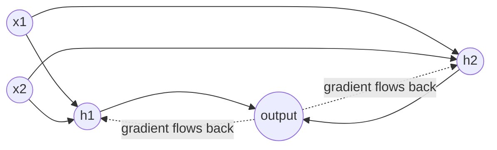

# Chapter 09 — Artificial Neural Networks

> From the biological neuron to your first Multi-Layer Perceptron.

**📅 Suggested pace:** Day 10 of the 30-day plan · [⬅ Back to main plan](../../README.md)

---

## 🧠 What this chapter is about

This chapter bridges classical ML and deep learning. It starts with the historically important — but limited — Perceptron, shows why stacking layers (MLPs) with non-linear activations fixes that limitation, and explains backpropagation at a conceptual level: forward pass, compute loss, propagate gradients backward, update weights. By the end you understand *why* neural networks can approximate almost any function, even before touching PyTorch.

## 📌 Key concepts

- The Perceptron and its limitations (XOR problem)
- Multi-Layer Perceptrons (MLPs) and backpropagation, conceptually
- Activation functions: sigmoid, tanh, ReLU and why they matter
- MLPs for regression and classification
- Hyperparameter choices: layers, neurons, activation, learning rate

## 🗺️ Visual overview

## 💡 Key takeaway

> Depth + non-linear activations is what lets neural nets model patterns a single linear layer never could.

## 🛠️ Practice in `09_artificial_neural_networks.ipynb`

This folder's notebook is a **starter**, not a solution key. Work through the book's examples first, then use
these prompts to go one step further on your own:

1. Show by hand why a single Perceptron cannot learn XOR
2. Train an MLP with 0, 1, and 3 hidden layers on the same task and compare
3. Swap ReLU for sigmoid activations and observe training speed differences

## ✅ Progress

- [ ] Read the chapter
- [ ] Ran and understood the book's code examples
- [ ] Completed the practice exercises above in `09_artificial_neural_networks.ipynb`
- [ ] Could explain this chapter's key takeaway to someone else in 2 minutes

---

⬅ [Chapter 08](../08-unsupervised-learning/README.md) · [Main README](../../README.md) · ➡ [Chapter 10](../10-neural-nets-with-pytorch/README.md)
