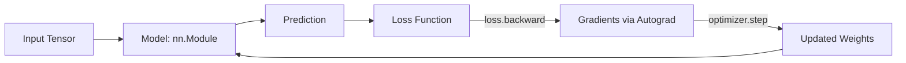

# Chapter 10 — Neural Nets with PyTorch

> Your new default toolkit: tensors, autograd, torch.nn, and getting models into production.

**📅 Suggested pace:** Day 11 of the 30-day plan · [⬅ Back to main plan](../../README.md)

---

## 🧠 What this chapter is about

This is the practical on-ramp to PyTorch. You'll learn the core objects — tensors and autograd — and how they replace NumPy arrays and manual calculus. Then you build the training loop you'll reuse for the rest of the book: forward pass, compute loss, backward(), optimizer.step(). The chapter also introduces Optuna for automated hyperparameter search and touches on getting a model ready to deploy.

## 📌 Key concepts

- Tensors, GPU acceleration, and autograd
- Building models with torch.nn.Module
- Training loops: forward, loss, backward, optimizer.step()
- TorchVision & TorchMetrics
- Hyperparameter tuning with Optuna
- The basics of saving/serving a trained model

## 🗺️ Visual overview

## 💡 Key takeaway

> Every deep learning model you build from here on is the same 5-line loop: forward, loss, backward, step, repeat.

## 🛠️ Practice in `10_neural_nets_with_pytorch.ipynb`

This folder's notebook is a **starter**, not a solution key. Work through the book's examples first, then use
these prompts to go one step further on your own:

1. Rewrite Chapter 9's MLP for MNIST in raw PyTorch instead of Scikit-Learn
2. Move a training loop from CPU to GPU and benchmark the speedup
3. Use Optuna to search learning rate + hidden layer size over 20 trials

## ✅ Progress

- [ ] Read the chapter
- [ ] Ran and understood the book's code examples
- [ ] Completed the practice exercises above in `10_neural_nets_with_pytorch.ipynb`
- [ ] Could explain this chapter's key takeaway to someone else in 2 minutes

---

⬅ [Chapter 09](../09-artificial-neural-networks/README.md) · [Main README](../../README.md) · ➡ [Chapter 11](../11-training-deep-neural-networks/README.md)
