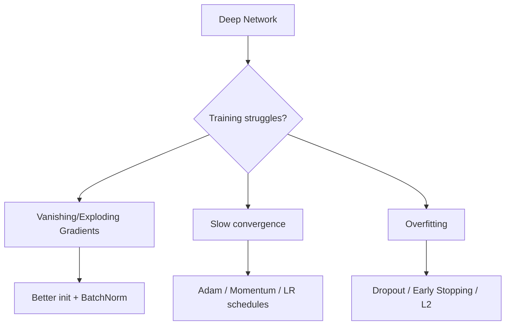

# Chapter 11 — Training Deep Neural Networks

> Why deep nets are hard to train, and the toolbox that makes it work anyway.

**📅 Suggested pace:** Day 12 of the 30-day plan · [⬅ Back to main plan](../../README.md)

---

## 🧠 What this chapter is about

Stacking many layers (Chapter 9-10) introduces new failure modes: gradients that vanish or explode as they propagate backward through dozens of layers. This chapter is the practitioner's fix-it kit: smarter initialization, Batch Normalization, adaptive optimizers like Adam, learning rate schedules, and regularization techniques like Dropout. It closes with transfer learning — reusing a pretrained network instead of training from scratch.

## 📌 Key concepts

- Vanishing/exploding gradients & better weight initialization
- Batch Normalization
- Faster optimizers: Momentum, RMSProp, Adam
- Learning rate scheduling
- Avoiding overfitting: Dropout, early stopping, weight regularization
- Transfer learning

## 🗺️ Visual overview

## 💡 Key takeaway

> Depth doesn't come for free — every trick in this chapter exists to keep gradients healthy as they flow through many layers.

## 🛠️ Practice in `11_training_deep_neural_networks.ipynb`

This folder's notebook is a **starter**, not a solution key. Work through the book's examples first, then use
these prompts to go one step further on your own:

1. Train the same deep MLP with SGD vs. Adam and compare convergence speed
2. Add Dropout and Batch Normalization to a model and compare validation curves
3. Fine-tune a pretrained model on a small dataset via transfer learning

## ✅ Progress

- [ ] Read the chapter
- [ ] Ran and understood the book's code examples
- [ ] Completed the practice exercises above in `11_training_deep_neural_networks.ipynb`
- [ ] Could explain this chapter's key takeaway to someone else in 2 minutes

---

⬅ [Chapter 10](../10-neural-nets-with-pytorch/README.md) · [Main README](../../README.md) · ➡ [Chapter 12](../12-deep-computer-vision-with-cnns/README.md)
