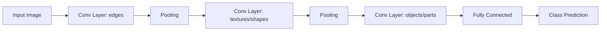

# Chapter 12 — Deep Computer Vision with CNNs

> Teaching networks to exploit the one thing images have that tabular data doesn't: spatial structure.

**📅 Suggested pace:** Days 13-14 of the 30-day plan · [⬅ Back to main plan](../../README.md)

---

## 🧠 What this chapter is about

Fully-connected layers ignore the fact that nearby pixels are related — CNNs fix that by sliding small filters across the image, building feature maps that detect edges, then textures, then whole objects, layer by layer. This chapter covers the anatomy of a CNN, tours landmark architectures, and extends classification into object detection and segmentation using pretrained TorchVision models.

## 📌 Key concepts

- Convolutional layers, filters, and feature maps
- Pooling layers and translation invariance
- Classic CNN architectures (LeNet, AlexNet, ResNet, etc.)
- Object detection & semantic/instance segmentation basics
- TorchVision pretrained models & transfer learning for vision

## 🗺️ Visual overview

## 💡 Key takeaway

> A CNN's superpower isn't more parameters — it's the built-in assumption that nearby pixels matter more than distant ones.

## 🛠️ Practice in `12_deep_computer_vision_with_cnns.ipynb`

This folder's notebook is a **starter**, not a solution key. Work through the book's examples first, then use
these prompts to go one step further on your own:

1. Visualize the feature maps of the first conv layer on one input image
2. Fine-tune a pretrained ResNet on a small custom image dataset (transfer learning)
3. Compare a CNN vs. an MLP with the same parameter count on image classification accuracy

## ✅ Progress

- [ ] Read the chapter
- [ ] Ran and understood the book's code examples
- [ ] Completed the practice exercises above in `12_deep_computer_vision_with_cnns.ipynb`
- [ ] Could explain this chapter's key takeaway to someone else in 2 minutes

---

⬅ [Chapter 11](../11-training-deep-neural-networks/README.md) · [Main README](../../README.md) · ➡ [Chapter 13](../13-processing-sequences-using-rnns-and-cnns/README.md)
