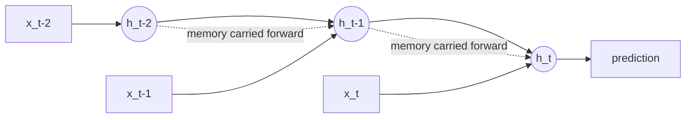

# Chapter 13 — Processing Sequences Using RNNs and CNNs

> When order matters: time series, and the memory problem.

**📅 Suggested pace:** Day 15 of the 30-day plan · [⬅ Back to main plan](../../README.md)

---

## 🧠 What this chapter is about

Sequential data — time series, sensor streams, early text — has order that a plain feedforward network throws away. RNNs process one step at a time while carrying a hidden state forward, but plain RNNs forget quickly over long sequences due to vanishing gradients. LSTM and GRU cells add gating mechanisms to preserve long-range memory, and the chapter also shows 1D CNNs as a surprisingly effective, parallelizable alternative.

## 📌 Key concepts

- Recurrent Neural Networks (RNNs) and hidden state
- Vanishing gradients over long sequences
- LSTM and GRU cells
- 1D convolutions for sequences (WaveNet-style)
- Forecasting univariate & multivariate time series

## 🗺️ Visual overview

## 💡 Key takeaway

> Plain RNNs forget quickly — LSTM/GRU gates exist purely to give the network a choice about what to remember.

## 🛠️ Practice in `13_processing_sequences_using_rnns_and_cnns.ipynb`

This folder's notebook is a **starter**, not a solution key. Work through the book's examples first, then use
these prompts to go one step further on your own:

1. Forecast a real time series (stock, weather, sales) with a plain RNN, then an LSTM
2. Compare an LSTM vs. a 1D-CNN on the same sequence task for speed and accuracy
3. Visualize how far back a vanilla RNN can 'remember' by testing on synthetic long-range-dependency data

## ✅ Progress

- [ ] Read the chapter
- [ ] Ran and understood the book's code examples
- [ ] Completed the practice exercises above in `13_processing_sequences_using_rnns_and_cnns.ipynb`
- [ ] Could explain this chapter's key takeaway to someone else in 2 minutes

---

⬅ [Chapter 12](../12-deep-computer-vision-with-cnns/README.md) · [Main README](../../README.md) · ➡ [Chapter 14](../14-nlp-with-rnns-and-attention/README.md)
