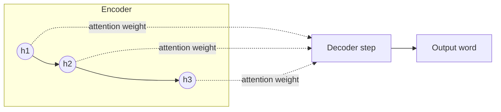

# Chapter 14 — Natural Language Processing with RNNs and Attention

> Text as sequences — and the attention mechanism that makes Transformers possible.

**📅 Suggested pace:** Day 16 of the 30-day plan · [⬅ Back to main plan](../../README.md)

---

## 🧠 What this chapter is about

Before Transformers, sequence-to-sequence NLP relied on encoder-decoder RNNs — but forcing an entire sentence through one fixed-size vector loses information, especially in long sentences. This chapter introduces the Attention mechanism as the elegant fix: let the decoder look back at *all* encoder states, weighted by relevance, at every decoding step. This one idea is the direct ancestor of the Transformer in the next chapter.

## 📌 Key concepts

- Text preprocessing, tokenization, and word embeddings
- Encoder-decoder architectures for sequence-to-sequence tasks (e.g., translation)
- The bottleneck problem with fixed-size context vectors
- The Attention mechanism as the fix
- Sentiment analysis with RNNs

## 🗺️ Visual overview

## 💡 Key takeaway

> Attention exists to solve one problem: don't force a whole sentence through one bottleneck vector — let the model look back at everything.

## 🛠️ Practice in `14_nlp_with_rnns_and_attention.ipynb`

This folder's notebook is a **starter**, not a solution key. Work through the book's examples first, then use
these prompts to go one step further on your own:

1. Train a sentiment classifier using word embeddings + an RNN
2. Build a tiny encoder-decoder translator on a toy parallel dataset
3. Visualize attention weights as a heatmap over source and target words

## ✅ Progress

- [ ] Read the chapter
- [ ] Ran and understood the book's code examples
- [ ] Completed the practice exercises above in `14_nlp_with_rnns_and_attention.ipynb`
- [ ] Could explain this chapter's key takeaway to someone else in 2 minutes

---

⬅ [Chapter 13](../13-processing-sequences-using-rnns-and-cnns/README.md) · [Main README](../../README.md) · ➡ [Chapter 15](../15-transformers-for-nlp-and-chatbots/README.md)
