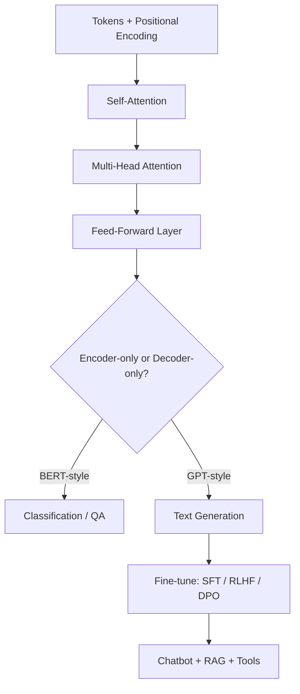

# Chapter 15 — Transformers for NLP and Chatbots

> Build a Transformer from scratch, then fine-tune real LLMs into a working chatbot.

**📅 Suggested pace:** Days 17-19 of the 30-day plan · [⬅ Back to main plan](../../README.md)

---

## 🧠 What this chapter is about

The centerpiece chapter of the book. You implement a Transformer from scratch to build an English→Spanish translator, then study the two dominant families that came from it: encoder-only models like BERT (understanding tasks) and decoder-only models like GPT (generation). From there, it goes fully practical — using Hugging Face pretrained models to build a chatbot, fine-tuning it with SFT/RLHF/DPO, and grounding its answers with RAG, vector databases, and tool-calling via MCP.

## 📌 Key concepts

- Self-attention & multi-head attention, from scratch
- The full Transformer architecture (encoder/decoder, positional encoding)
- Encoder-only models (BERT) for classification & QA
- Decoder-only models (GPT) for generation & zero-shot learning
- Fine-tuning with SFT, RLHF, and DPO
- RAG, vector databases, and tool-use / MCP for chatbots

## 🗺️ Visual overview

## 💡 Key takeaway

> Attention isn't an add-on to Transformers — it IS the Transformer; everything else is plumbing around it.

## 🛠️ Practice in `15_transformers_for_nlp_and_chatbots.ipynb`

This folder's notebook is a **starter**, not a solution key. Work through the book's examples first, then use
these prompts to go one step further on your own:

1. Implement scaled dot-product attention from scratch in PyTorch, no shortcuts
2. Fine-tune a small pretrained model (e.g. DistilBERT) on a text classification dataset
3. Build a minimal RAG pipeline: embed documents, retrieve top-k, feed to an LLM prompt

## ✅ Progress

- [ ] Read the chapter
- [ ] Ran and understood the book's code examples
- [ ] Completed the practice exercises above in `15_transformers_for_nlp_and_chatbots.ipynb`
- [ ] Could explain this chapter's key takeaway to someone else in 2 minutes

---

⬅ [Chapter 14](../14-nlp-with-rnns-and-attention/README.md) · [Main README](../../README.md) · ➡ [Chapter 16](../16-vision-and-multimodal-transformers/README.md)
