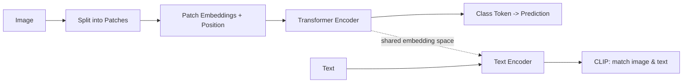

# Chapter 16 — Vision and Multimodal Transformers

> Transformers escape text: images, video, and models that connect the two.

**📅 Suggested pace:** Day 20 of the 30-day plan · [⬅ Back to main plan](../../README.md)

---

## 🧠 What this chapter is about

If images can be cut into patches and treated like 'visual words,' Transformers work on them too — that's the whole insight behind the Vision Transformer (ViT). This chapter tours the vision-Transformer family (ViT, Swin, DINO) and then moves into multimodal models like CLIP that learn a shared space for images and text, enabling zero-shot image classification and models like DALL·E that generate images from prompts.

## 📌 Key concepts

- Vision Transformer (ViT) and patch embeddings
- Efficient variants: DEiT, Swin, PVT
- Self-supervised vision (DINO)
- Multimodal models: CLIP, BLIP, Flamingo
- Text-to-image generation basics (DALL·E)

## 🗺️ Visual overview

## 💡 Key takeaway

> ViT's trick is deceptively simple: patches are just tokens, so everything Transformers do for text now works for pixels.

## 🛠️ Practice in `16_vision_and_multimodal_transformers.ipynb`

This folder's notebook is a **starter**, not a solution key. Work through the book's examples first, then use
these prompts to go one step further on your own:

1. Run a pretrained ViT on your own images and inspect attention maps over patches
2. Use CLIP for zero-shot classification on a set of images with custom text labels
3. Compare a CNN vs. a ViT of similar size on the same small image dataset

## ✅ Progress

- [ ] Read the chapter
- [ ] Ran and understood the book's code examples
- [ ] Completed the practice exercises above in `16_vision_and_multimodal_transformers.ipynb`
- [ ] Could explain this chapter's key takeaway to someone else in 2 minutes

---

⬅ [Chapter 15](../15-transformers-for-nlp-and-chatbots/README.md) · [Main README](../../README.md) · ➡ [Chapter 17](../17-speeding-up-transformers/README.md)
