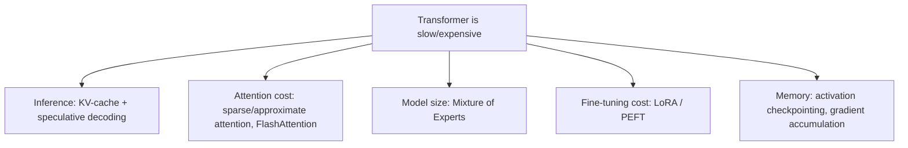

# Chapter 17 — Speeding Up Transformers

> Making the models from Ch.15-16 fast and cheap enough to actually deploy.

**📅 Suggested pace:** Day 21 of the 30-day plan · [⬅ Back to main plan](../../README.md)

---

## 🧠 What this chapter is about

Transformers are powerful but expensive — quadratic attention cost and huge parameter counts make naive inference and training slow. This chapter is an engineering deep-dive into every major lever for speeding things up: caching key/value pairs during generation, approximating attention instead of computing it exactly, routing through a Mixture of Experts instead of one giant dense model, and fine-tuning efficiently with LoRA instead of updating every parameter.

## 📌 Key concepts

- KV-caching and speculative decoding
- Sparse & approximate attention (Longformer, Reformer, Performer, etc.)
- Multi-query / grouped-query / multi-head latent attention, FlashAttention
- Mixture of Experts (MoE) for scaling
- Parameter-efficient fine-tuning: LoRA and friends
- Activation checkpointing, gradient accumulation, parallelism

## 🗺️ Visual overview

## 💡 Key takeaway

> Most 'speedups' here don't change what the model computes — they change how cleverly it avoids repeating work.

## 🛠️ Practice in `17_speeding_up_transformers.ipynb`

This folder's notebook is a **starter**, not a solution key. Work through the book's examples first, then use
these prompts to go one step further on your own:

1. Benchmark generation speed with and without KV-caching on the same model
2. Fine-tune a model with LoRA and compare trainable-parameter count vs. full fine-tuning
3. Read one FlashAttention benchmark and summarize why it's faster despite doing the 'same' math

## ✅ Progress

- [ ] Read the chapter
- [ ] Ran and understood the book's code examples
- [ ] Completed the practice exercises above in `17_speeding_up_transformers.ipynb`
- [ ] Could explain this chapter's key takeaway to someone else in 2 minutes

---

⬅ [Chapter 16](../16-vision-and-multimodal-transformers/README.md) · [Main README](../../README.md) · ➡ [Chapter 18](../18-autoencoders-gans-and-diffusion-models/README.md)
