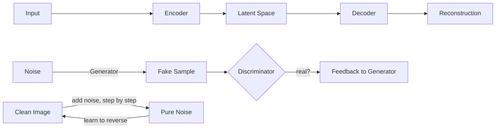

# Chapter 18 — Autoencoders, GANs, and Diffusion Models

> Teaching networks to compress data — and then to generate brand-new data.

**📅 Suggested pace:** Days 22-23 of the 30-day plan · [⬅ Back to main plan](../../README.md)

---

## 🧠 What this chapter is about

This chapter is about generative modeling: not just recognizing patterns, but producing new, realistic data. Autoencoders learn to compress and reconstruct; VAEs make that latent space smooth enough to sample new points from it. GANs pit a generator against a discriminator in an adversarial game. Diffusion models — today's dominant approach for image generation — learn to reverse a gradual noising process, one denoising step at a time.

## 📌 Key concepts

- Autoencoders for dimensionality reduction & denoising
- Variational Autoencoders (VAEs) and the latent space
- Generative Adversarial Networks (GANs): generator vs. discriminator
- Training instability & mode collapse in GANs
- Diffusion models: forward noising, reverse denoising
- Using pretrained diffusion models

## 🗺️ Visual overview

## 💡 Key takeaway

> Autoencoders, GANs, and diffusion models all answer the same question differently: what does the 'shape' of realistic data look like, and how do we sample from it?

## 🛠️ Practice in `18_autoencoders_gans_and_diffusion_models.ipynb`

This folder's notebook is a **starter**, not a solution key. Work through the book's examples first, then use
these prompts to go one step further on your own:

1. Train a simple autoencoder to denoise corrupted MNIST images
2. Train a GAN on a small dataset (e.g. Fashion-MNIST) and watch for mode collapse
3. Run a pretrained diffusion model and visualize a few denoising steps, not just the final image

## ✅ Progress

- [ ] Read the chapter
- [ ] Ran and understood the book's code examples
- [ ] Completed the practice exercises above in `18_autoencoders_gans_and_diffusion_models.ipynb`
- [ ] Could explain this chapter's key takeaway to someone else in 2 minutes

---

⬅ [Chapter 17](../17-speeding-up-transformers/README.md) · [Main README](../../README.md) · ➡ [Chapter 19](../19-reinforcement-learning/README.md)
