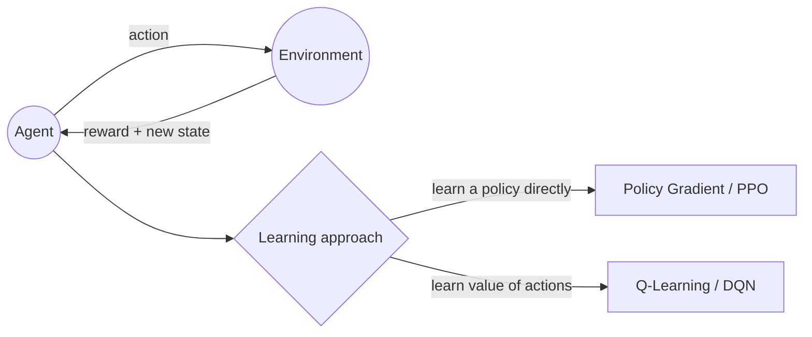

# Chapter 19 — Reinforcement Learning

> Learning from trial, error, and reward instead of labeled examples.

**📅 Suggested pace:** Days 24-25 of the 30-day plan · [⬅ Back to main plan](../../README.md)

---

## 🧠 What this chapter is about

Reinforcement Learning flips the supervised-learning setup: there's no labeled 'correct answer,' just an agent, an environment, and a reward signal it tries to maximize over time. This chapter builds up from Policy Gradients to modern Actor-Critic algorithms like PPO, and Q-Learning/DQN as the value-based alternative. It ends hands-on, training an agent to play an Atari game using the Stable-Baselines3 library.

## 📌 Key concepts

- Markov Decision Processes, policies, and rewards
- Policy Gradients
- Actor-Critic methods, including PPO
- Q-Learning and Deep Q-Networks
- Training agents with Stable-Baselines3 (e.g. on Atari)

## 🗺️ Visual overview

## 💡 Key takeaway

> In RL, the reward function IS the specification — a subtly wrong reward produces a perfectly-optimized agent that solves the wrong problem.

## 🛠️ Practice in `19_reinforcement_learning.ipynb`

This folder's notebook is a **starter**, not a solution key. Work through the book's examples first, then use
these prompts to go one step further on your own:

1. Implement a basic Q-Learning agent on a simple grid-world (e.g. FrozenLake)
2. Train a PPO agent with Stable-Baselines3 on a Gym environment and plot the reward curve
3. Compare how sensitive your agent's training is to the reward function's shape

## ✅ Progress

- [ ] Read the chapter
- [ ] Ran and understood the book's code examples
- [ ] Completed the practice exercises above in `19_reinforcement_learning.ipynb`
- [ ] Could explain this chapter's key takeaway to someone else in 2 minutes

---

⬅ [Chapter 18](../18-autoencoders-gans-and-diffusion-models/README.md) · [Main README](../../README.md) · ➡ [Chapter — you made it! 🎉](../../README.md)
